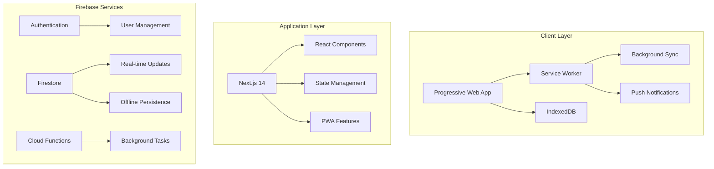
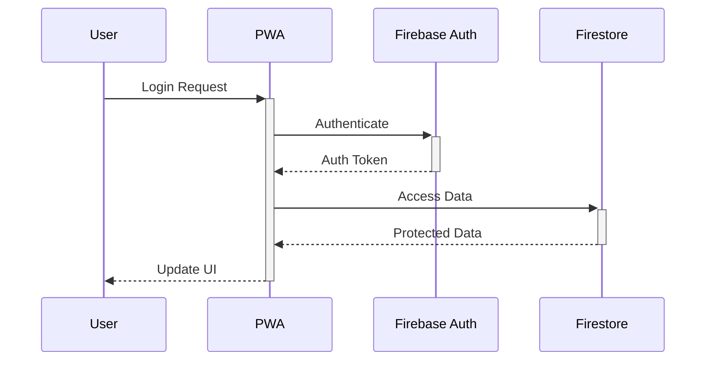

# Half Day App Core Architecture

---
type: specification
category: architecture
status: active
created: 2024-11-30
tags:
  - spec/architecture
  - tech/firebase
  - tech/pwa
  - tech/nextjs
  - phase/implementation
  - architecture/offline-first
related:
  - [[Tech Stack Decision]]
  - [[PWA Implementation Strategy]]
  - [[Offline Sync Architecture]]
  - [[Firebase Configuration]]
---

## Overview
Comprehensive architecture specification for the Half Day App, implementing a Firebase-backed Progressive Web Application (PWA) with robust offline capabilities and real-time synchronization.

## System Architecture



## Core Components

### Frontend Architecture
1. Progressive Web App
   - Service Worker implementation
   - Offline-first design
   - Background sync capabilities
   - Push notification support

2. Next.js Framework
   - Server-side rendering
   - API routes
   - Static optimization
   - Dynamic imports

### Backend Services
1. Firebase Infrastructure
   ```typescript
   interface FirebaseServices {
     auth: FirebaseAuth;
     firestore: Firestore;
     functions: FirebaseFunctions;
     storage: FirebaseStorage;
   }
   ```

2. Data Layer
   ```typescript
   interface DataLayer {
     // Core collections
     users: Collection<User>;
     workDays: Collection<WorkDay>;
     locations: Collection<Location>;
     trucks: Collection<Truck>;
     
     // Supporting collections
     userSettings: Collection<UserSettings>;
     syncQueue: Collection<SyncQueueItem>;
     auditLog: Collection<AuditLogEntry>;
   }
   ```

## Offline Strategy

### Local Storage
```typescript
interface OfflineStorage {
  // Primary data store
  indexedDB: {
    workDays: WorkDay[];
    userSettings: UserSettings;
    syncQueue: SyncQueueItem[];
  };
  
  // Cache storage
  cache: {
    assets: string[];
    apiResponses: Response[];
    staticContent: string[];
  };
}
```

### Sync Mechanism
1. Queue-Based Synchronization
   ```typescript
   interface SyncQueue {
     pending: Change[];
     processing: Change[];
     failed: Change[];
     timestamp: number;
   }
   ```

2. Conflict Resolution
   ```typescript
   type ConflictResolution = {
     strategy: 'server-wins' | 'client-wins' | 'manual';
     resolution: (conflict: Conflict) => Promise<void>;
   };
   ```

## Security Implementation

### Authentication Flow


### Authorization Rules
```typescript
interface SecurityRules {
  collections: {
    workDays: {
      read: (userId: string) => boolean;
      write: (userId: string, isAdmin: boolean) => boolean;
    };
    userSettings: {
      read: (userId: string) => boolean;
      write: (userId: string) => boolean;
    };
  };
}
```

## Performance Optimization

### Caching Strategy
1. Static Assets
   - Long-term caching
   - Versioned updates
   - Preloading critical assets

2. Dynamic Data
   - Smart prefetching
   - Incremental sync
   - Partial updates

## Implementation Roadmap

### Phase 1: Foundation
- [x] Firebase project setup
- [x] PWA configuration
- [ ] Authentication implementation
- [ ] Basic offline storage

### Phase 2: Core Features
- [ ] Calendar interface
- [ ] Work status management
- [ ] Real-time sync
- [ ] Admin dashboard

### Phase 3: Advanced Features
- [ ] Push notifications
- [ ] Advanced offline capabilities
- [ ] Report generation
- [ ] Analytics integration

## Related Resources
- [[Firebase Setup Guide]]
- [[PWA Implementation Strategy]]
- [[Offline Sync Architecture]]
- [[Security Configuration]]

## Notes
1. Implementation Priorities
   - Start with PWA architecture from day one
   - Focus on offline reliability
   - Optimize for mobile users
   - Monitor Firebase usage

2. Performance Targets
   - < 2s initial load
   - < 500ms offline data access
   - 100% offline functionality
   - Real-time sync when online

3. Security Considerations
   - Regular security audits
   - Data encryption at rest
   - Secure authentication flow
   - Role-based access control
