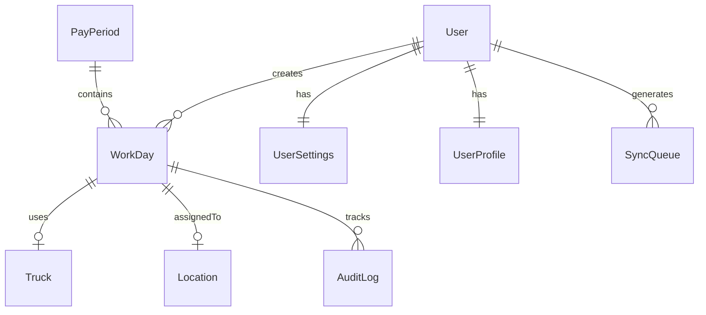

# Data Models Specification

---

type: specification
category: data-models
status: finalized
created: 2024-11-30
tags:

- spec/data
- tech/firebase
- tech/typescript
- feature/offline-sync
- phase/implementation
  related:
- [[Tech Stack Decision]]
- [[Offline Sync Architecture]]
- [[Firebase Schema Design]]

---

## Overview

Finalized data model specifications for the Half Day App, optimized for Firebase/Firestore implementation with offline-first PWA architecture.

## Core Data Models

### User Model

```typescript
interface User {
  id: string;
  email: string;
  name: string;
  role: UserRole;
  active: boolean;
  lastSyncTimestamp: number;
  created: FirebaseTimestamp;
  updated: FirebaseTimestamp;
}

enum UserRole {
  WORKER = "WORKER",
  ADMIN = "ADMIN",
  MANAGER = "MANAGER",
}

interface UserSettings {
  userId: string;
  defaultLocation?: string;
  defaultTruck?: string;
  notifications: boolean;
  theme: "light" | "dark" | "system";
  offlineDaysToKeep: number;
}

interface UserProfile {
  userId: string;
  phone?: string;
  avatar?: string;
  emergencyContact?: string;
  preferredLanguage: string;
}
```

### WorkDay Model

```typescript
interface WorkDay {
  id: string; // Compound ID: {userId}_{dateString}
  userId: string;
  date: FirebaseTimestamp;
  status: WorkStatus;
  truckId?: string;
  locationId?: string;
  notes?: string;
  modifiedAt: FirebaseTimestamp;
  modifiedBy: string;
  syncStatus: SyncStatus;
  locked: boolean;
  version: number; // For conflict resolution
}

enum WorkStatus {
  FULL = "FULL",
  HALF = "HALF",
  OFF = "OFF",
}

enum SyncStatus {
  PENDING = "PENDING",
  SYNCED = "SYNCED",
  CONFLICT = "CONFLICT",
}
```

### Sync Management Models

```typescript
interface SyncQueue {
  id: string;
  userId: string;
  operation: "CREATE" | "UPDATE" | "DELETE";
  entityType: "WORKDAY" | "SETTINGS";
  entityId: string;
  data: any;
  timestamp: FirebaseTimestamp;
  attempts: number;
  status: "PENDING" | "PROCESSING" | "FAILED";
}

interface OfflineMetadata {
  userId: string;
  lastSyncTimestamp: number;
  syncInProgress: boolean;
  pendingChanges: number;
  storageUsage: number;
}
```

### Supporting Models

```typescript
interface PayPeriod {
  id: string;
  startDate: FirebaseTimestamp;
  endDate: FirebaseTimestamp;
  lockedAt?: FirebaseTimestamp;
  lockedBy?: string;
  status: PayPeriodStatus;
  version: number;
}

enum PayPeriodStatus {
  OPEN = "OPEN",
  LOCKED = "LOCKED",
  PROCESSED = "PROCESSED",
}

interface Location {
  id: string;
  name: string;
  active: boolean;
  lastModified: FirebaseTimestamp;
}

interface Truck {
  id: string;
  number: string;
  active: boolean;
  lastModified: FirebaseTimestamp;
}

interface AuditLog {
  id: string;
  userId: string;
  action: string;
  entityType: "WORKDAY" | "USER" | "PAYPERIOD";
  entityId: string;
  changes: Record<string, any>;
  timestamp: FirebaseTimestamp;
  syncedFromOffline: boolean;
}
```

## Firestore Schema



## Implementation Details

### Collection Structure

```typescript
interface FirestoreCollections {
  users: Collection<User>;
  "users/{userId}/settings": Collection<UserSettings>;
  "users/{userId}/profile": Collection<UserProfile>;
  workDays: Collection<WorkDay>;
  syncQueue: Collection<SyncQueue>;
  offlineMetadata: Collection<OfflineMetadata>;
  payPeriods: Collection<PayPeriod>;
  locations: Collection<Location>;
  trucks: Collection<Truck>;
  auditLog: Collection<AuditLog>;
}
```

### Indexing Strategy

```typescript
const requiredIndexes = {
  workDays: [
    ["userId", "date"],
    ["userId", "syncStatus"],
    ["locationId", "date"],
    ["truckId", "date"],
  ],
  syncQueue: [
    ["userId", "status", "timestamp"],
    ["entityType", "entityId"],
  ],
};
```

## Related Resources

- [[Firebase Data Modeling Guide]]
- [[Offline First Data Strategy]]
- [[Sync Implementation Details]]

## Notes

1. All timestamps use Firebase server timestamp
2. Compound IDs optimize offline sync
3. Version tracking enables conflict resolution
4. Collection structure optimized for querying patterns
5. Regular monitoring of collection sizes needed
