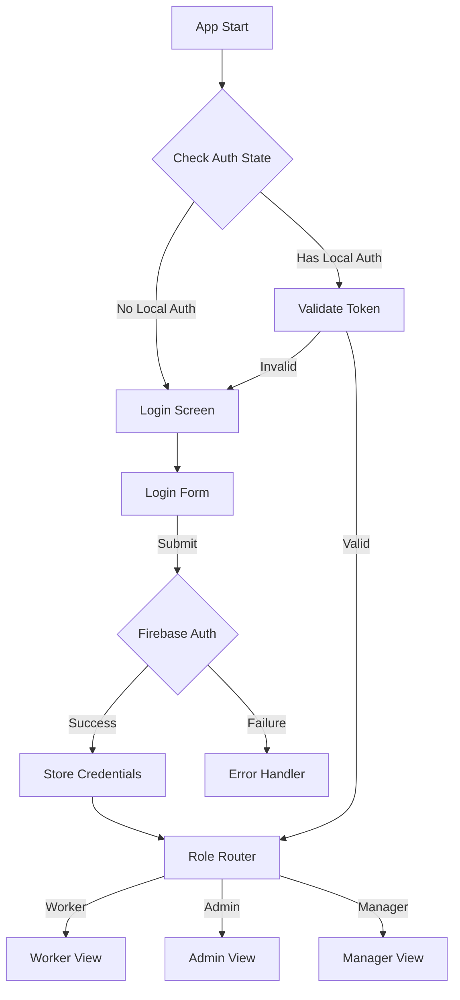

# Authentication Implementation Specification

---

type: specification
category: auth
status: finalized
created: 2024-11-30
tags:

- spec/auth
- tech/firebase
- feature/offline-auth
- phase/implementation
- security/authentication
  related:
- [[Firebase Security Rules]]
- [[Offline Authentication Strategy]]
- [[PWA Implementation]]

---

## Overview

Comprehensive authentication implementation specification for the Half Day App, utilizing Firebase Authentication with offline support through PWA architecture.

## Authentication Flow



## Implementation Details

### Firebase Configuration

```typescript
interface FirebaseAuthConfig {
  persistence: 'LOCAL';
  sessionDuration: 30 * 24 * 60 * 60 * 1000; // 30 days
  offlineAccess: true;
  customClaims: {
    role: UserRole;
    permissions: string[];
  };
}
```

### Authentication States

```typescript
type AuthState = {
  status: "authenticated" | "unauthenticated" | "loading";
  user: {
    uid: string;
    email: string;
    role: UserRole;
    lastLogin: number;
    offlineAccess: boolean;
  } | null;
  error?: AuthError;
};
```

## Offline Authentication

### Local Storage Strategy

```typescript
interface OfflineAuthStorage {
  token: string;
  refreshToken: string;
  user: {
    uid: string;
    role: UserRole;
    permissions: string[];
  };
  expiry: number;
}
```

### Token Management

```typescript
interface TokenManager {
  validateToken: (token: string) => Promise<boolean>;
  refreshIfNeeded: () => Promise<void>;
  handleOfflineAccess: () => Promise<boolean>;
  syncOnReconnect: () => Promise<void>;
}
```

## Security Implementation

### Role-Based Access

```typescript
enum UserRole {
  WORKER = "WORKER",
  ADMIN = "ADMIN",
  MANAGER = "MANAGER",
}

interface RolePermissions {
  WORKER: {
    read: ["own-profile", "own-workdays"];
    write: ["own-profile", "own-workdays"];
  };
  ADMIN: {
    read: ["all-profiles", "all-workdays", "reports"];
    write: ["all-profiles", "all-workdays", "system-config"];
  };
  MANAGER: {
    read: ["team-profiles", "team-workdays"];
    write: ["team-workdays", "team-reports"];
  };
}
```

### Firebase Security Rules

```typescript
rules_version = '2';
service cloud.firestore {
  match /databases/{database}/documents {
    // User profile access
    match /users/{userId} {
      allow read: if isAuthenticated() &&
        (isAdmin() || request.auth.uid == userId);
      allow write: if isAuthenticated() &&
        (isAdmin() || request.auth.uid == userId);
    }

    // WorkDay access
    match /workDays/{dayId} {
      allow read: if isAuthenticated() &&
        (isAdmin() || request.auth.uid == resource.data.userId);
      allow write: if isAuthenticated() &&
        (isAdmin() || (
          request.auth.uid == resource.data.userId &&
          !resource.data.locked
        ));
    }
  }
}
```

## User Interface Components

### Login Screen

```typescript
interface LoginScreen {
  components: {
    emailInput: TextField;
    passwordInput: SecureField;
    rememberMe: Checkbox;
    submitButton: Button;
    forgotPassword: Link;
  };
  validation: {
    email: EmailValidator;
    password: PasswordStrengthValidator;
  };
  state: {
    loading: boolean;
    error: string | null;
    offlineMode: boolean;
  };
}
```

### Error Handling

```typescript
interface AuthError {
  code: string;
  message: string;
  userMessage: string;
  action?: "retry" | "reset" | "contact-support";
}

const errorMessages: Record<string, string> = {
  "auth/invalid-credentials": "Invalid email or password",
  "auth/network-error": "Cannot connect. Using offline mode.",
  "auth/too-many-requests": "Too many attempts. Try again later.",
};
```

## Implementation Checklist

### Phase 1: Basic Authentication

- [x] Firebase Auth setup
- [x] Login/logout flow
- [x] Role-based routing
- [x] Basic error handling

### Phase 2: Offline Support

- [ ] Local storage implementation
- [ ] Token management
- [ ] Offline access rules
- [ ] Sync mechanisms

### Phase 3: Enhanced Security

- [ ] Session management
- [ ] Token refresh logic
- [ ] Security rules testing
- [ ] Audit logging

## Related Resources

- [[Firebase Auth Best Practices]]
- [[Offline Authentication Patterns]]
- [[Security Implementation Guide]]

## Notes

1. All authentication states must handle offline scenarios
2. Token refresh should happen in background
3. Security rules require thorough testing
4. Consider rate limiting for failed attempts
5. Implement proper session termination for payroll lock
