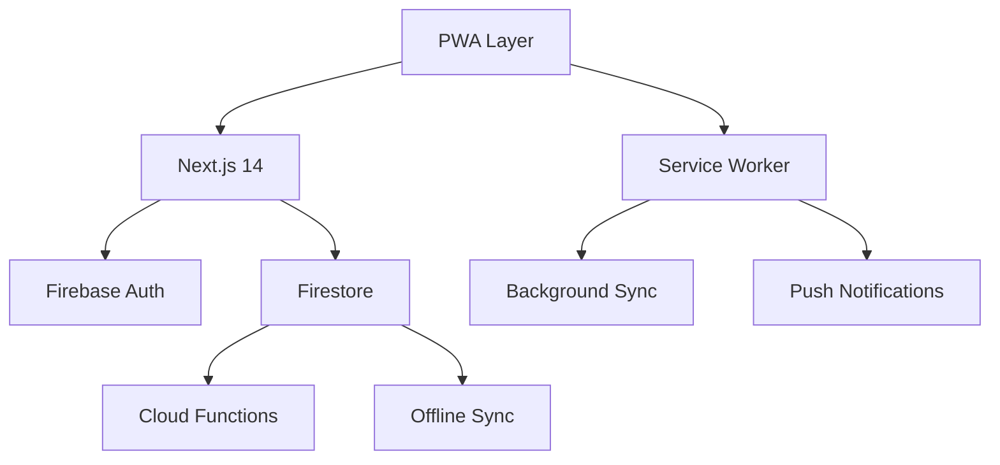

# Technical Stack Decision Document

---
type: decision
category: architecture
status: completed
created: 2024-11-30
impact: high
tags:
  - decision/tech-stack
  - tech/firebase
  - tech/pwa
  - tech/nextjs
  - phase/implementation
stakeholders:
  - Development Team
  - System Admin
  - Business Owner
related:
  - [[Firebase Setup Guide]]
  - [[PWA Implementation Strategy]]
  - [[Offline Sync Architecture]]
---

## Overview
Final technical stack decision for the Half Day App, implementing Firebase with PWA architecture from initial release.

## Architecture Diagram



## Core Components

### Frontend Stack
- Next.js 14
- Tailwind CSS
- shadcn/ui
- React Calendar
- PWA Implementation

### Backend Services
- Firebase Authentication
- Firestore Database
- Cloud Functions
- Firebase Hosting

## Data Architecture

### Collection Structure
```typescript
// Primary Collections
users/                 // User profiles
workDays/             // Work day records
locations/            // Work locations 
trucks/               // Truck inventory
payPeriods/           // Pay periods
auditLog/             // Change history

// Supporting Collections
userSettings/         // App preferences
syncQueue/            // Offline sync queue
```

### Query Optimization
```typescript
// Compound ID Structure
workDays/{userId}_{date}  

// Index Configuration
- userId + date range
- location + date
- truck + date
```

## Authentication Strategy

### Role-Based Access
```typescript
enum UserRole {
  WORKER,
  ADMIN,
  MANAGER
}

interface AuthConfig {
  persistence: 'LOCAL',
  rememberMe: true,
  customClaims: {
    role: UserRole,
    locationAccess: string[],
    truckAccess: string[]
  }
}
```

## Offline Sync Architecture

### Local Storage Strategy
- IndexedDB for offline data storage
- 60-day local data retention
- Queue-based change management

### Sync Process
1. Background sync via Service Worker
2. Timestamp-based conflict resolution
3. Admin change precedence
4. User notification system

## Implementation Phases

### Phase 1: Foundation
- [ ] Firebase project setup
- [ ] PWA configuration
- [ ] Authentication implementation

### Phase 2: Core Features
- [ ] Offline storage setup
- [ ] Sync queue implementation
- [ ] Basic CRUD operations

### Phase 3: Advanced Features
- [ ] Push notifications
- [ ] Background sync
- [ ] Advanced caching

## Decision Rationale

### PWA Benefits
1. Offline functionality
2. "Install" capability
3. Push notifications
4. Background sync
5. Automatic updates

### Firebase Advantages
1. Built-in authentication
2. Real-time updates
3. Simple deployment
4. Existing infrastructure

## Performance Considerations

### Offline Performance
- Local data access patterns
- Sync queue optimization
- Cache management

### Online Performance
- Real-time sync strategies
- Data pagination
- Query optimization

## Security Implementation

### Firebase Rules
```typescript
match /workDays/{docId} {
  allow read: if isAuthenticated() && (
    isAdmin() || 
    doc.data.userId == request.auth.uid
  );
  allow write: if isAuthenticated() && (
    isAdmin() ||
    (doc.data.userId == request.auth.uid && !doc.data.locked)
  );
}
```

## Related Resources
- [[Firebase Security Best Practices]]
- [[PWA Implementation Guide]]
- [[Offline First Architecture]]
- [[Real-time Sync Patterns]]

## Notes
- Implementation begins with PWA architecture
- Firebase configuration requires security audit
- Regular performance monitoring needed
- Cost analysis to be conducted monthly
